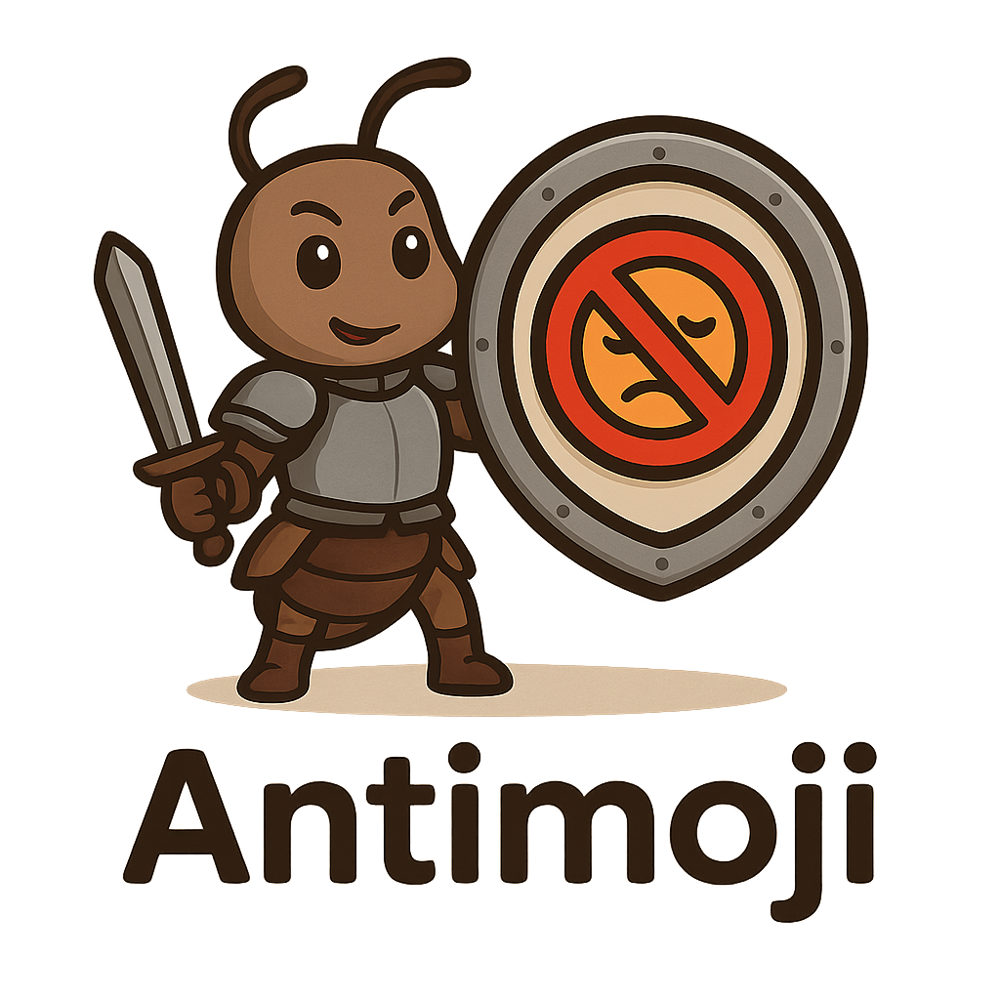

<!-- markdownlint-disable MD033 MD041 -->
<div align="center">
  
  <h1>Antimoji</h1>
  
  <p>
    <a href="https://github.com/jamesainslie/antimoji/actions/workflows/ci.yml"></a>
    <a href="https://github.com/jamesainslie/antimoji/actions/workflows/build.yml"></a>
    <a href="https://github.com/jamesainslie/antimoji/actions/workflows/nightly.yml"></a>
    <br/>
    <a href="https://golang.org"></a>
    <a href="https://github.com/jamesainslie/antimoji/releases"></a>
    <a href="https://github.com/jamesainslie/antimoji"></a>
    <br/>
    <a href="LICENSE"></a>
    <a href="https://github.com/jamesainslie/antimoji/commits/main"></a>
    <a href="https://goreportcard.com/report/github.com/jamesainslie/antimoji"></a>
    <a href="https://pkg.go.dev/github.com/jamesainslie/antimoji"></a>
  </p>
</div>
<!-- markdownlint-enable MD033 MD041 -->

> A blazing-fast CLI tool and linter for detecting and removing emojis from code files and documentation.

Antimoji is a high-performance emoji detection and removal tool built with Go using functional programming principles. **Designed primarily as a linter**, it provides comprehensive emoji scanning and cleaning capabilities for maintaining professional, emoji-free codebases with seamless CI/CD and pre-commit integration.

## Features

### Core Capabilities
- **Unicode Emoji Detection**: Comprehensive support for Unicode 15.0+ emojis
- **Text Emoticon Detection**: Recognizes `:)`, `:(`, `:D` and other emoticons  
- **Custom Pattern Detection**: Supports `:smile:`, `:thumbs_up:` style patterns
- **Multi-Rune Support**: Handles skin tone modifiers and ZWJ sequences
- **Allowlist Filtering**: Configurable patterns to preserve specific emojis

### File Operations
- **Safe File Modification**: Atomic operations prevent data corruption
- **Backup Creation**: Automatic backups with timestamp naming
- **Permission Preservation**: Maintains original file permissions
- **Streaming Processing**: Memory-efficient handling of large files
- **Binary File Detection**: Automatically skips non-text files

### CLI Interface
- **Multiple Commands**: `scan` for detection, `clean` for removal, `generate` for configuration
- **Output Formats**: Table, JSON, and CSV formats
- **Configuration Profiles**: Default, strict, and CI/CD profiles
- **Performance Statistics**: Built-in benchmarking and metrics
- **Dry-Run Mode**: Preview changes without file modification

### Linting & Integration
- **CI/CD Linting**: Designed for automated emoji policy enforcement
- **Pre-commit Hooks**: Auto-clean emojis before commits with backup creation
- **Configurable Allowlists**: Smart emoji filtering for legitimate use cases
- **Self-Linting**: Antimoji uses itself to maintain emoji-free codebase
- **Threshold-based Policies**: Fail builds when emoji limits exceeded

## Installation

### From Source
```bash
git clone https://github.com/jamesainslie/antimoji.git
cd antimoji
make build
sudo cp bin/antimoji /usr/local/bin/
```

### Using Go Install
```bash
go install github.com/jamesainslie/antimoji/cmd/antimoji@latest
```

## Quick Start

### Scan for Emojis
```bash
# Scan current directory
antimoji scan .

# Scan specific files
antimoji scan file.go README.md

# Recursive scan with statistics
antimoji scan --recursive --stats src/

# JSON output for automation
antimoji scan --format json .
```

### Remove Emojis
```bash
# Preview changes (safe)
antimoji clean --dry-run .

# Remove emojis with backup
antimoji clean --backup --in-place .

# Custom replacement text
antimoji clean --replace "[EMOJI]" --in-place .

# Respect allowlist configuration
antimoji clean --respect-allowlist --in-place .
```

## Linting Policies & Configuration

### Policy Enforcement

Antimoji supports multiple emoji policies for different use cases:

```bash
# Zero-tolerance policy (strict linting)
antimoji scan --threshold=0 --ignore-allowlist .

# Allowlist-based policy (recommended)
antimoji scan --config=.antimoji.yaml --profile=ci-lint --threshold=0 .

# Permissive policy (development)
antimoji scan --threshold=10 .
```

### Configuration Generation

```bash
# Generate configuration based on current project usage
antimoji generate --type=ci-lint --output=.antimoji.yaml .

# Available generation types:
# ci-lint    - Strict allowlist for CI/CD linting
# dev        - Permissive allowlist for development
# test-only  - Only allow emojis found in test files
# docs-only  - Only allow emojis found in documentation
# minimal    - Only frequently used emojis
# full       - All found emojis with categorization
```

## Configuration

Antimoji uses XDG-compliant configuration files:

```yaml
# ~/.config/antimoji/config.yaml
version: "0.5.0"
profiles:
  default:
    # File processing
    recursive: true
    follow_symlinks: false
    backup_files: false
    
    # Emoji detection
    unicode_emojis: true
    text_emoticons: true
    custom_patterns: [":smile:", ":frown:", ":thumbs_up:"]
    
    # Allowlist (emojis to preserve)
    emoji_allowlist:
      - "✅"  # Checkmark for task completion
      - "❌"  # Cross mark for failures
      - "⚠️"  # Warning symbol
    
    # File filters
    include_patterns: ["*.go", "*.md", "*.js", "*.py", "*.ts"]
    exclude_patterns: ["vendor/*", "node_modules/*", ".git/*"]
    
    # Output
    output_format: "table"
    show_progress: true
    colored_output: true
```

### Configuration Profiles

#### Default Profile
Balanced settings for general development use with common allowlisted emojis.

#### Strict Profile
Zero-tolerance policy - removes all emojis regardless of type.

#### CI Profile
Optimized for CI/CD pipelines with JSON output and specific error codes.

## Usage Examples

### Development Workflow
```bash
# Generate project-specific allowlist
antimoji generate --type=ci-lint --output=.antimoji.yaml .

# Check for emojis before commit
antimoji scan --config=.antimoji.yaml --profile=ci-lint --threshold=0 .

# Clean codebase maintaining allowlisted emojis
antimoji clean --config=.antimoji.yaml --respect-allowlist --backup --in-place .

# Generate report for code review
antimoji scan --config=.antimoji.yaml --format=json > emoji-report.json
```

### Quick Start for Linting
```bash
# Install and set up linting in 3 commands
go install github.com/jamesainslie/antimoji/cmd/antimoji@latest
antimoji generate --type=ci-lint --output=.antimoji.yaml .
antimoji scan --config=.antimoji.yaml --profile=ci-lint --threshold=0 .
```

## Linting Integration

Antimoji is designed primarily as a **linter** for automated emoji policy enforcement in development workflows.

### Generate Allowlist Configuration

```bash
# Analyze current project and generate strict allowlist
antimoji generate --type=ci-lint --output=.antimoji.yaml .

# Generate development-friendly allowlist
antimoji generate --type=dev --output=.antimoji-dev.yaml .

# Generate minimal allowlist (only frequently used emojis)
antimoji generate --type=minimal --min-usage=3 .
```

### Pre-commit Integration

**Automatic Setup:**
```bash
# Install pre-commit framework and antimoji hooks
make install-pre-commit

# Generate antimoji configuration
make generate-allowlist

# Test the integration
make test-pre-commit
```

**Manual Setup - Add to your `.pre-commit-config.yaml`:**
```yaml
repos:
  # Antimoji emoji linting with auto-cleaning
  - repo: https://github.com/jamesainslie/antimoji
    rev: v0.9.1  # Use latest release
    hooks:
      # Strict linting - fails if emojis found in source code
      - id: antimoji-lint
        files: \.(go|js|ts|jsx|tsx|py|rb|java|c|cpp|h|hpp|rs|php|swift|kt|scala)$
        exclude: .*_test\.|.*/test/.*|.*/testdata/.*
        
      # Auto-clean emojis with backup (recommended)
      - id: antimoji-clean
        files: \.(go|js|ts|jsx|tsx|py|rb|java|c|cpp|h|hpp|rs|php|swift|kt|scala)$
        exclude: .*_test\.|.*/test/.*|.*/testdata/.*
        
      # Documentation checking (permissive)
      - id: antimoji-docs
        files: \.(md|rst|txt)$
```

**Local Repository Setup:**
```yaml
repos:
  - repo: local
    hooks:
      - id: antimoji-strict
        name: Antimoji Strict Linter
        entry: bin/antimoji scan --threshold=0 --ignore-allowlist --quiet
        language: system
        files: \.(go|js|ts|py|java|c|cpp|rs)$
        exclude: .*_test\.|.*/test/.*
        pass_filenames: true
```

### CI/CD Integration

**GitHub Actions Example:**
```yaml
name: CI

on: [push, pull_request]

jobs:
  emoji-lint:
    name: Emoji Linting
    runs-on: ubuntu-latest
    steps:
      - uses: actions/checkout@v4
      
      - name: Set up Go
        uses: actions/setup-go@v4
        with:
          go-version: '1.21'
          
      - name: Install Antimoji
        run: go install github.com/jamesainslie/antimoji/cmd/antimoji@latest
        
      - name: Generate Allowlist
        run: antimoji generate --type=ci-lint --output=.antimoji.yaml .
        
      - name: Lint for Emojis
        run: antimoji scan --config=.antimoji.yaml --profile=ci-lint --threshold=0 --format=json .
```

**GitLab CI Example:**
```yaml
emoji-lint:
  stage: test
  image: golang:1.21
  script:
    - go install github.com/jamesainslie/antimoji/cmd/antimoji@latest
    - antimoji generate --type=ci-lint --output=.antimoji.yaml .
    - antimoji scan --config=.antimoji.yaml --profile=ci-lint --threshold=0 .
  rules:
    - if: $CI_PIPELINE_SOURCE == "merge_request_event"
    - if: $CI_COMMIT_BRANCH == $CI_DEFAULT_BRANCH
```

**Jenkins Pipeline Example:**
```groovy
pipeline {
    agent any
    stages {
        stage('Emoji Lint') {
            steps {
                sh 'go install github.com/jamesainslie/antimoji/cmd/antimoji@latest'
                sh 'antimoji generate --type=ci-lint --output=.antimoji.yaml .'
                sh 'antimoji scan --config=.antimoji.yaml --profile=ci-lint --threshold=0 .'
            }
        }
    }
}
```

**Docker Integration:**
```dockerfile
# In your Dockerfile for CI
FROM golang:1.21-alpine AS linter
RUN go install github.com/jamesainslie/antimoji/cmd/antimoji@latest
COPY . /app
WORKDIR /app
RUN antimoji scan --threshold=0 --ignore-allowlist .
```

## Real-World Examples

### Self-Linting Project

Antimoji uses itself for emoji linting! Here's how:

**Configuration (`.antimoji.yaml`):**
```yaml
version: "0.5.0"
profiles:
  ci-lint:
    # Scan source code and build files
    include_patterns: ["*.go", "*.js", "*.py", "Makefile", "*.mk"]
    
    # Allow legitimate emojis from tests and docs
    emoji_allowlist: ["😀", "✅", "❌", ":)", ":(", ":smile:"]
    
    # Exclude files that legitimately contain emojis
    file_ignore_list: ["*_test.go", "*.md", "generate.go", "config.go"]
    
    # Fail build if emojis found in production code
    fail_on_found: true
    max_emoji_threshold: 0
```

**GitHub Actions Integration:**
```yaml
# From .github/workflows/ci.yml
antimoji-lint:
  name: Antimoji Lint
  runs-on: ubuntu-latest
  steps:
    - uses: actions/checkout@v4
    - name: Build antimoji
      run: make build
    - name: Run antimoji linter
      run: |
        if [ -f ".antimoji.yaml" ]; then
          ./bin/antimoji scan --config=.antimoji.yaml --profile=ci-lint --threshold=0 .
        else
          ./bin/antimoji generate --type=ci-lint --output=.antimoji.yaml .
          ./bin/antimoji scan --config=.antimoji.yaml --profile=ci-lint --threshold=0 .
        fi
```

**Makefile Integration:**
```makefile
# From Makefile
antimoji-lint: build
	@echo "Running antimoji linter..."
	@./bin/antimoji scan --config=.antimoji.yaml --profile=ci-lint --threshold=0 .

generate-allowlist: build
	@echo "Generating antimoji allowlist configuration..."
	@./bin/antimoji generate --type=ci-lint --output=.antimoji.yaml .

check-all: deps fmt vet lint antimoji-lint security-scan test-coverage-check
	@echo "All quality checks passed!"
```

### Enterprise Integration

**Multi-Language Repository:**
```yaml
# .antimoji.yaml for polyglot projects
profiles:
  strict:
    include_patterns: 
      - "*.go"      # Backend
      - "*.ts"      # Frontend  
      - "*.py"      # Scripts
      - "*.java"    # Services
      - "Makefile"  # Build
    emoji_allowlist: []  # Zero tolerance
    fail_on_found: true
```

**Gradual Adoption:**
```bash
# Phase 1: Documentation only
antimoji generate --type=docs-only --output=.antimoji.yaml .

# Phase 2: Add test files  
antimoji generate --type=test-only --output=.antimoji.yaml .

# Phase 3: Full source code
antimoji generate --type=ci-lint --output=.antimoji.yaml .
```

### Large Repository Processing
```bash
# High-performance scanning
antimoji scan --recursive --stats --workers 8 .

# Memory-efficient cleaning
antimoji clean --stream --in-place large-repo/
```

## Performance

Antimoji is optimized for high-performance processing:

- **Small files (<1KB)**: >10,000 files/second
- **Medium files (1-100KB)**: >1,000 files/second  
- **Large files (>1MB)**: >100MB/second throughput
- **Memory usage**: <50MB for typical repositories
- **Startup time**: <100ms cold start

## Architecture

Antimoji follows clean architecture principles with functional programming:

```
CLI Layer          → Cobra commands, Viper config
Application Layer  → Command handlers, Config manager
Business Logic     → Emoji detector, File processor, Allowlist manager
Infrastructure     → File system, Concurrency, Memory management
```

### Key Design Principles
- **Functional Programming**: Pure functions and immutable data
- **Performance First**: Zero-copy operations and memory pooling
- **Safety Emphasis**: Atomic operations and comprehensive error handling
- **Test-Driven**: 85% minimum test coverage requirement

## Development

### Prerequisites
- Go 1.21 or later
- Make (for build automation)

### Development Setup
```bash
git clone https://github.com/jamesainslie/antimoji.git
cd antimoji
make dev-setup
make test-watch
```

### Running Tests
```bash
# Run all tests
make test

# Test with coverage
make test-coverage

# Run benchmarks
make benchmark

# Quality checks
make check-all
```

### Build
```bash
# Development build
make build

# Release build
make build-release
```

## Contributing

1. Fork the repository
2. Create a feature branch (`git checkout -b feature/amazing-feature`)
3. Write tests first (TDD approach)
4. Implement feature maintaining 85% test coverage
5. Ensure all linting passes (`make lint`)
6. Commit changes (`git commit -m 'feat: add amazing feature'`)
7. Push to branch (`git push origin feature/amazing-feature`)
8. Open a Pull Request

### Development Standards
- 85% minimum test coverage
- Zero golangci-lint warnings
- Functional programming principles
- Comprehensive documentation

## License

This project is licensed under the MIT License - see the [LICENSE](LICENSE) file for details.

## Acknowledgments

- Built with [Cobra](https://github.com/spf13/cobra) for CLI framework
- Configuration powered by [Viper](https://github.com/spf13/viper)
- Testing with [Testify](https://github.com/stretchr/testify)
- Follows [Semantic Versioning](https://semver.org/)
- Inspired by functional programming principles

## Support

- **Documentation**: See [docs/](docs/) directory
- **Issues**: [GitHub Issues](https://github.com/jamesainslie/antimoji/issues)
- **Discussions**: [GitHub Discussions](https://github.com/jamesainslie/antimoji/discussions)
- **Email**: james@ainslies.us

---

**Antimoji** - Keeping your codebase clean and professional, one emoji at a time.
