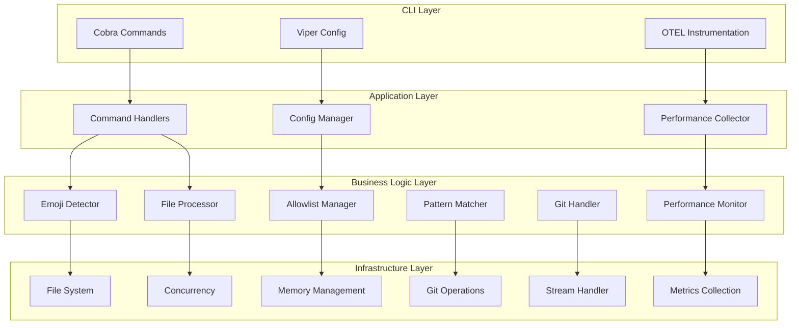
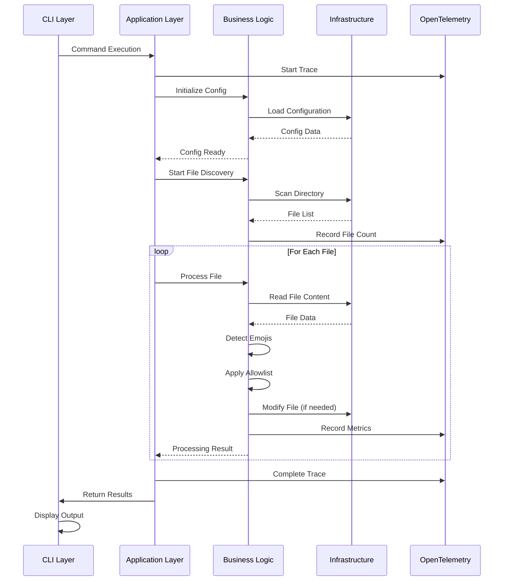
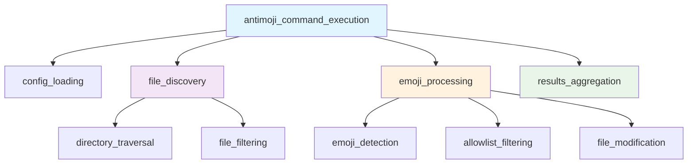
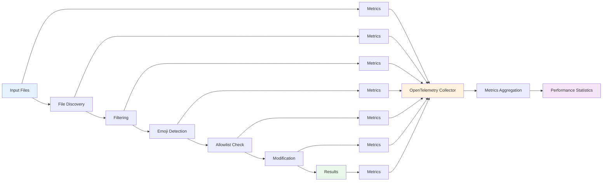
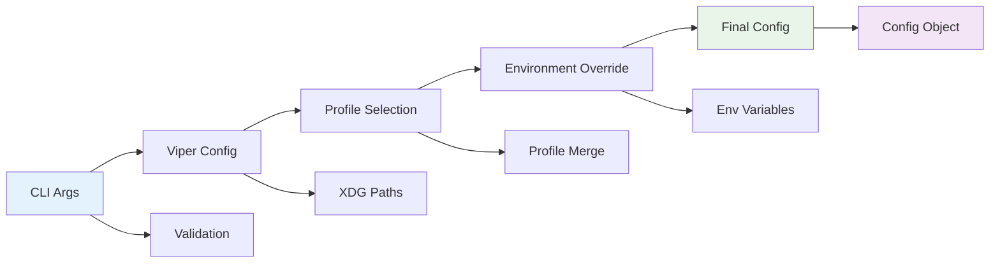
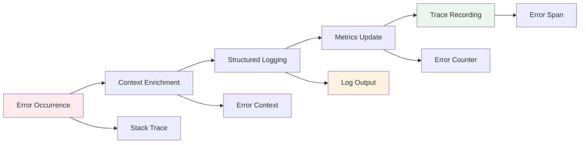
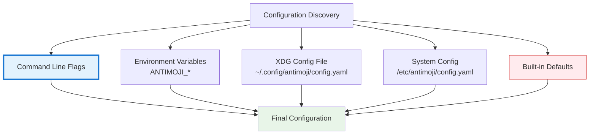

# Antimoji Architecture Documentation

## Overview

Antimoji is designed as a high-performance, functional programming-based CLI tool for emoji detection and removal. The architecture prioritizes immutability, pure functions, and concurrent processing to achieve blazing-fast performance while maintaining code reliability and testability.

## Architectural Principles

### 1. Functional Programming Paradigm
- **Pure Functions**: All core processing functions are pure, making them predictable and easily testable
- **Immutable Data Structures**: Use of Go's functional programming patterns with immutable data
- **Function Composition**: Complex operations built from composable smaller functions
- **Higher-Order Functions**: Leverage functions as first-class citizens for processing pipelines

### 2. Performance-First Design
- **Zero-Copy Operations**: Minimize memory allocations and copying
- **Streaming Architecture**: Process files as streams to handle large files efficiently
- **Concurrent Processing**: Leverage Go's goroutines for parallel file processing
- **Memory Pool Management**: Reuse buffers and objects to reduce GC pressure

### 3. Observability-Driven Development
- **OpenTelemetry Integration**: Comprehensive metrics, traces, and logs
- **Performance Metrics**: Real-time performance statistics collection
- **Usage Analytics**: Anonymous usage tracking for product improvement
- **Error Tracking**: Detailed error reporting and analysis

## System Architecture



## Processing Sequence



## Core Components

### 1. Functional Pipeline Architecture

#### File Processing Pipeline
```go
type ProcessingPipeline struct {
    FileDiscovery    func(config Config) <-chan FileInfo
    EmojiDetection   func(<-chan FileInfo) <-chan DetectionResult
    AllowlistFilter  func(<-chan DetectionResult) <-chan FilteredResult
    FileModification func(<-chan FilteredResult) <-chan ProcessResult
    MetricsCollection func(<-chan ProcessResult) <-chan Metrics
}
```

#### Functional Composition Pattern
```go
// Pure function for emoji detection
func DetectEmojis(content []byte, patterns EmojiPatterns) DetectionResult

// Pure function for allowlist filtering
func ApplyAllowlist(result DetectionResult, allowlist AllowlistConfig) FilteredResult

// Composed processing function
func ProcessFile(filepath string) ProcessResult {
    return filepath |>
        ReadFile |>
        DetectEmojis |>
        ApplyAllowlist |>
        GenerateResult
}
```

### 2. Performance-Optimized Components

#### Memory Pool Management
```go
type BufferPool struct {
    pool sync.Pool
}

func (bp *BufferPool) Get() *bytes.Buffer {
    return bp.pool.Get().(*bytes.Buffer)
}

func (bp *BufferPool) Put(buf *bytes.Buffer) {
    buf.Reset()
    bp.pool.Put(buf)
}
```

#### Streaming File Processor
```go
type StreamProcessor struct {
    ChunkSize   int
    BufferPool  *BufferPool
    Concurrency int
}

func (sp *StreamProcessor) ProcessLargeFile(filepath string) <-chan ChunkResult {
    results := make(chan ChunkResult, sp.Concurrency)
    
    go func() {
        defer close(results)
        // Stream processing implementation
        file, _ := os.Open(filepath)
        defer file.Close()
        
        for chunk := range sp.readChunks(file) {
            go sp.processChunk(chunk, results)
        }
    }()
    
    return results
}
```

### 3. Concurrent Processing Engine

#### Worker Pool Pattern
```go
type WorkerPool struct {
    WorkerCount int
    JobQueue    chan Job
    ResultQueue chan Result
    Workers     []*Worker
}

type Job struct {
    FilePath string
    Config   ProcessingConfig
    Metrics  *MetricsCollector
}

func (wp *WorkerPool) Start(ctx context.Context) {
    for i := 0; i < wp.WorkerCount; i++ {
        worker := &Worker{
            ID:          i,
            JobQueue:    wp.JobQueue,
            ResultQueue: wp.ResultQueue,
        }
        wp.Workers[i] = worker
        go worker.Start(ctx)
    }
}
```

#### Fan-Out/Fan-In Pattern
```go
func FanOutFanIn(input <-chan FileInfo, workers int) <-chan ProcessResult {
    // Fan-out: distribute work across multiple workers
    workerChannels := make([]<-chan ProcessResult, workers)
    
    for i := 0; i < workers; i++ {
        workerChan := make(chan ProcessResult)
        workerChannels[i] = workerChan
        
        go func(jobs <-chan FileInfo, results chan<- ProcessResult) {
            defer close(results)
            for job := range jobs {
                results <- ProcessFile(job)
            }
        }(input, workerChan)
    }
    
    // Fan-in: merge results from all workers
    return MergeChannels(workerChannels...)
}
```

### 4. OpenTelemetry Integration

#### Metrics Collection
```go
type MetricsCollector struct {
    // Counters
    FilesProcessed    metric.Int64Counter
    EmojisDetected    metric.Int64Counter
    EmojisRemoved     metric.Int64Counter
    ErrorsEncountered metric.Int64Counter
    
    // Histograms
    ProcessingDuration metric.Float64Histogram
    FileSize          metric.Int64Histogram
    MemoryUsage       metric.Int64Histogram
    
    // Gauges
    ActiveWorkers     metric.Int64UpDownCounter
    QueueDepth        metric.Int64UpDownCounter
}

func (mc *MetricsCollector) RecordFileProcessed(ctx context.Context, 
    duration time.Duration, fileSize int64, emojisFound int) {
    
    mc.FilesProcessed.Add(ctx, 1)
    mc.ProcessingDuration.Record(ctx, duration.Seconds())
    mc.FileSize.Record(ctx, fileSize)
    mc.EmojisDetected.Add(ctx, int64(emojisFound))
}
```

#### Tracing Implementation
```go
func ProcessFileWithTracing(ctx context.Context, filepath string) ProcessResult {
    tracer := otel.Tracer("antimoji")
    ctx, span := tracer.Start(ctx, "process_file",
        trace.WithAttributes(
            attribute.String("file.path", filepath),
        ))
    defer span.End()
    
    // Add file size attribute
    if stat, err := os.Stat(filepath); err == nil {
        span.SetAttributes(attribute.Int64("file.size", stat.Size()))
    }
    
    result := processFileInternal(ctx, filepath)
    
    // Record results in span
    span.SetAttributes(
        attribute.Int("emojis.detected", result.EmojisDetected),
        attribute.Int("emojis.removed", result.EmojisRemoved),
        attribute.Bool("success", result.Success),
    )
    
    if !result.Success {
        span.RecordError(result.Error)
        span.SetStatus(codes.Error, result.Error.Error())
    }
    
    return result
}
```

### 5. Configuration Management

#### Functional Configuration Pattern
```go
type ConfigOption func(*Config) *Config

func WithEmojiAllowlist(allowlist []string) ConfigOption {
    return func(c *Config) *Config {
        newConfig := *c // Copy
        newConfig.EmojiAllowlist = allowlist
        return &newConfig
    }
}

func WithConcurrency(workers int) ConfigOption {
    return func(c *Config) *Config {
        newConfig := *c
        newConfig.MaxWorkers = workers
        return &newConfig
    }
}

func NewConfig(options ...ConfigOption) *Config {
    config := &Config{
        // Default values
        MaxWorkers:      runtime.NumCPU(),
        BufferSize:      64 * 1024,
        EmojiAllowlist:  []string{},
    }
    
    for _, option := range options {
        config = option(config)
    }
    
    return config
}
```

### 6. Error Handling Strategy

#### Functional Error Handling
```go
type Result[T any] struct {
    Value T
    Error error
}

func (r Result[T]) Map[U any](fn func(T) U) Result[U] {
    if r.Error != nil {
        return Result[U]{Error: r.Error}
    }
    return Result[U]{Value: fn(r.Value)}
}

func (r Result[T]) FlatMap[U any](fn func(T) Result[U]) Result[U] {
    if r.Error != nil {
        return Result[U]{Error: r.Error}
    }
    return fn(r.Value)
}

// Usage example
func ProcessFileChain(filepath string) Result[ProcessResult] {
    return ReadFileResult(filepath).
        FlatMap(DetectEmojisResult).
        FlatMap(ApplyAllowlistResult).
        Map(GenerateProcessResult)
}
```

## Performance Optimizations

### 1. Memory Management

#### Object Pooling
```go
var (
    // Global pools for common objects
    DetectionResultPool = sync.Pool{
        New: func() interface{} {
            return &DetectionResult{
                Emojis: make([]EmojiMatch, 0, 10),
            }
        },
    }
    
    ByteBufferPool = sync.Pool{
        New: func() interface{} {
            return make([]byte, 0, 4096)
        },
    }
)

func GetDetectionResult() *DetectionResult {
    return DetectionResultPool.Get().(*DetectionResult)
}

func PutDetectionResult(dr *DetectionResult) {
    dr.Reset()
    DetectionResultPool.Put(dr)
}
```

#### Zero-Copy String Operations
```go
// Use unsafe operations for zero-copy string to byte conversion
func StringToBytes(s string) []byte {
    return unsafe.Slice(unsafe.StringData(s), len(s))
}

func BytesToString(b []byte) string {
    return unsafe.String(unsafe.SliceData(b), len(b))
}
```

### 2. Concurrent Processing Patterns

#### Pipeline Parallelism
```go
func CreateProcessingPipeline(ctx context.Context, concurrency int) *Pipeline {
    return &Pipeline{
        FileDiscovery:    make(chan FileInfo, concurrency*2),
        EmojiDetection:   make(chan DetectionResult, concurrency*2),
        AllowlistFilter:  make(chan FilteredResult, concurrency*2),
        Results:         make(chan ProcessResult, concurrency*2),
    }
}

func (p *Pipeline) Start(ctx context.Context) {
    // Start each stage of the pipeline
    go p.runFileDiscovery(ctx)
    go p.runEmojiDetection(ctx)
    go p.runAllowlistFilter(ctx)
    go p.runResultCollection(ctx)
}
```

### 3. I/O Optimizations

#### Buffered File Reading
```go
type OptimizedFileReader struct {
    bufferSize int
    pool       *sync.Pool
}

func (ofr *OptimizedFileReader) ReadFile(filepath string) ([]byte, error) {
    file, err := os.Open(filepath)
    if err != nil {
        return nil, err
    }
    defer file.Close()
    
    // Get buffer from pool
    buffer := ofr.pool.Get().([]byte)
    defer ofr.pool.Put(buffer)
    
    // Use buffered reading for large files
    reader := bufio.NewReaderSize(file, ofr.bufferSize)
    return io.ReadAll(reader)
}
```

## Observability Architecture

### 1. Metrics Schema

#### Performance Metrics
```go
const (
    // Counter metrics
    MetricFilesProcessed    = "antimoji_files_processed_total"
    MetricEmojisDetected    = "antimoji_emojis_detected_total"
    MetricEmojisRemoved     = "antimoji_emojis_removed_total"
    MetricErrorsTotal       = "antimoji_errors_total"
    
    // Histogram metrics
    MetricProcessingDuration = "antimoji_processing_duration_seconds"
    MetricFileSize          = "antimoji_file_size_bytes"
    MetricMemoryUsage       = "antimoji_memory_usage_bytes"
    MetricQueueWaitTime     = "antimoji_queue_wait_duration_seconds"
    
    // Gauge metrics
    MetricActiveWorkers     = "antimoji_active_workers"
    MetricQueueDepth        = "antimoji_queue_depth"
    MetricMemoryAllocated   = "antimoji_memory_allocated_bytes"
)
```

#### Usage Analytics
```go
type UsageMetrics struct {
    // Anonymous usage tracking
    SessionID       string
    Version         string
    OS              string
    Architecture    string
    CommandUsed     string
    FilesProcessed  int64
    ProcessingTime  time.Duration
    ConfigProfile   string
    Features        []string
}

func (um *UsageMetrics) ToOTelAttributes() []attribute.KeyValue {
    return []attribute.KeyValue{
        attribute.String("session.id", um.SessionID),
        attribute.String("version", um.Version),
        attribute.String("os", um.OS),
        attribute.String("arch", um.Architecture),
        attribute.String("command", um.CommandUsed),
        attribute.Int64("files.processed", um.FilesProcessed),
        attribute.Float64("processing.time", um.ProcessingTime.Seconds()),
        attribute.String("config.profile", um.ConfigProfile),
        attribute.StringSlice("features", um.Features),
    }
}
```

### 2. Distributed Tracing

#### Trace Structure



#### Custom Span Events
```go
func RecordSpanEvents(span trace.Span, result ProcessResult) {
    span.AddEvent("emoji_detection_completed",
        trace.WithAttributes(
            attribute.Int("emojis.found", result.EmojisDetected),
            attribute.Float64("detection.duration", result.DetectionDuration.Seconds()),
        ))
    
    if result.EmojisRemoved > 0 {
        span.AddEvent("emojis_removed",
            trace.WithAttributes(
                attribute.Int("emojis.removed", result.EmojisRemoved),
                attribute.String("replacement.strategy", result.ReplacementStrategy),
            ))
    }
}
```

### 3. Logging Strategy

#### Structured Logging with OTEL
```go
type StructuredLogger struct {
    logger *slog.Logger
}

func (sl *StructuredLogger) LogWithTrace(ctx context.Context, level slog.Level, 
    msg string, attrs ...slog.Attr) {
    
    // Extract trace context
    spanCtx := trace.SpanContextFromContext(ctx)
    if spanCtx.IsValid() {
        attrs = append(attrs,
            slog.String("trace_id", spanCtx.TraceID().String()),
            slog.String("span_id", spanCtx.SpanID().String()),
        )
    }
    
    sl.logger.LogAttrs(ctx, level, msg, attrs...)
}
```

## Data Flow Architecture

### 1. Processing Flow



### 2. Configuration Flow



### 3. Error Flow



## Testing Architecture

### 1. Property-Based Testing
```go
func TestEmojiDetectionProperties(t *testing.T) {
    properties := []func(string) bool{
        // Property: Detection is deterministic
        func(input string) bool {
            result1 := DetectEmojis([]byte(input), defaultPatterns)
            result2 := DetectEmojis([]byte(input), defaultPatterns)
            return reflect.DeepEqual(result1, result2)
        },
        
        // Property: Allowlist filtering is monotonic
        func(input string) bool {
            allResults := DetectEmojis([]byte(input), defaultPatterns)
            filteredResults := ApplyAllowlist(allResults, emptyAllowlist)
            return len(filteredResults.Emojis) <= len(allResults.Emojis)
        },
    }
    
    for _, property := range properties {
        quick.Check(property, nil)
    }
}
```

### 2. Benchmark-Driven Development
```go
func BenchmarkEmojiDetection(b *testing.B) {
    testCases := []struct {
        name string
        size int
    }{
        {"small", 1024},
        {"medium", 64 * 1024},
        {"large", 1024 * 1024},
        {"xlarge", 10 * 1024 * 1024},
    }
    
    for _, tc := range testCases {
        b.Run(tc.name, func(b *testing.B) {
            content := generateTestContent(tc.size)
            b.ResetTimer()
            b.ReportAllocs()
            
            for i := 0; i < b.N; i++ {
                DetectEmojis(content, defaultPatterns)
            }
            
            b.ReportMetric(float64(tc.size*b.N)/b.Elapsed().Seconds(), "bytes/sec")
        })
    }
}
```

## Deployment Architecture

### 1. Binary Distribution
```go
// Embed version and build info
var (
    Version   = "dev"
    BuildTime = "unknown"
    GitCommit = "unknown"
)

func init() {
    // Embed build information for observability
    otel.SetTextMapPropagator(propagation.TraceContext{})
    
    // Initialize global metrics
    initializeMetrics()
}
```

### 2. Configuration Discovery



## Security Considerations

### 1. Safe File Operations
- Symlink attack prevention
- Path traversal protection
- File permission validation
- Atomic file operations

### 2. Privacy-Preserving Analytics
- Anonymous session IDs
- No personal data collection
- Opt-out mechanisms
- Local-only processing by default

## Performance Targets

### 1. Processing Speed
- **Small files (<1KB)**: >10,000 files/second
- **Medium files (1-100KB)**: >1,000 files/second  
- **Large files (>1MB)**: >100MB/second throughput

### 2. Memory Usage
- **Baseline**: <10MB resident memory
- **Per worker**: <5MB additional memory
- **Large files**: <2x file size peak memory

### 3. Startup Performance
- **Cold start**: <50ms to first file processed
- **Config loading**: <10ms
- **Worker initialization**: <20ms

This architecture provides a solid foundation for building a high-performance, observable, and maintainable emoji detection and removal tool that can scale from individual files to massive repositories while providing comprehensive insights into its usage and performance.
